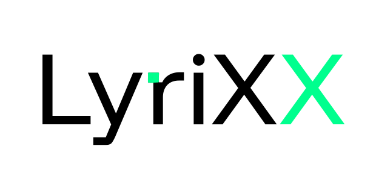
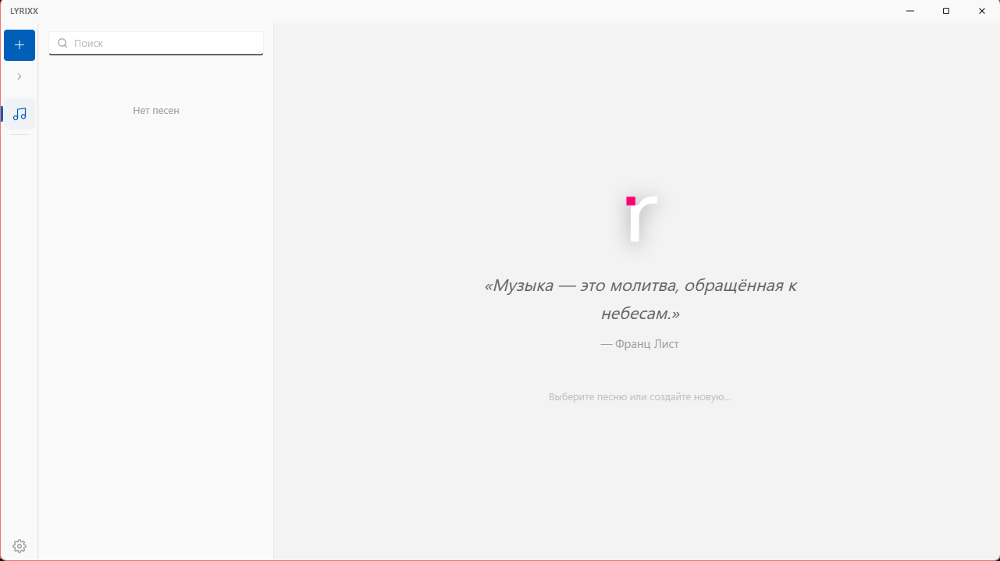
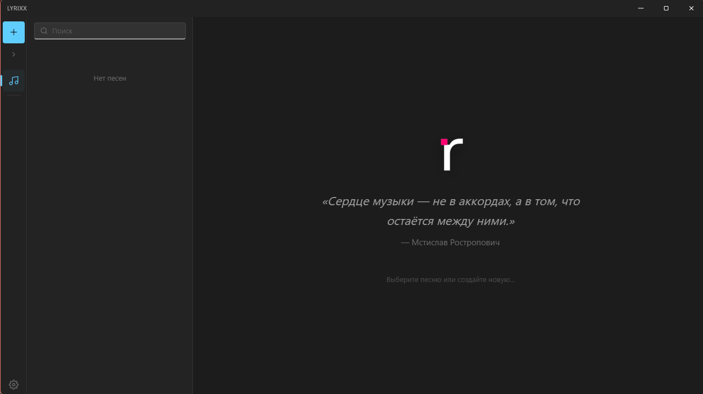

<p align="center">
  
</p>

<p align="center">
  &nbsp;&nbsp;
</p>

**Ваш личный блокнот для написания песен.** Чистый, вдохновляющий и всегда под рукой.

---

## Что это?

LyriXX — десктопное приложение, созданное специально для авторов песен. Никаких лишних отвлечений: только вы, ваши тексты и музыка.

Упорядочивайте песни и заготовки, быстро находите нужное, редактируйте — и всё сохраняется само.

## Возможности

- **Пишите песни.** Создавайте записи с названием, исполнителем и полным текстом.
- **Редактор на CodeMirror.** Мощный редактор с подсветкой тегов, автодополнением и встроенным поиском рифм.
- **Теги секций.** Помечайте части текста тегами: `[Куплет]`, `[Припев]`, `[Бридж]`, `[Интро]` и т.д. — они подсвечиваются цветом и парсятся из текста. 14 встроенных тегов + свои.
- **Навигатор секций.** Боковая панель с секциями: клик — прыжок к месту, drag-and-drop — перетаскивание секций.
- **Подсказки рифм.** Вводите слово — приложение покажет рифмы из словаря Зализняка + word2vec. Попап появляется прямо в редакторе. Язык рифм: русский или английский.
- **Определение языка.** Автоматическое определение языка текста (русский/английский) для рифм и подсветки.
- **Категории.** «Песни» для готового, «Заготовки» для идей. Можно менять и создавать свои. Выбирайте иконки для категорий.
- **Поиск.** Мгновенный поиск по названию или исполнителю среди всех записей.
- **Автосохранение.** Ни строчка не потеряется — всё сохраняется автоматически с настраиваемой задержкой.
- **Закрепление.** Закрепите важные песни — они всегда будут сверху.
- **Отдельные окна.** Открывайте песни в отдельных окнах для параллельного редактирования.
- **Мульти-выделение.** Выделяйте несколько песен и удаляйте их пачкой.
- **Drag-and-drop.** Перетаскивайте песни между категориями, а секции — внутри редактора.
- **Смена темы.** Тёмная, светлая или как у системы. Работайте в комфорте.
- **Акцентный цвет.** 12 пресетов акцентных цветов для персонализации интерфейса.
- **Подсчёт слогов.** Автоматический подсчёт слогов в русских и английских словах.
- **Настройки.** Размер шрифта, шрифт, межстрочный интервал, стиль курсора, автозакрытие скобок, сортировка, прозрачность окна, анимации и многое другое — всё в 9 вкладках настроек.
- **Локализация.** Интерфейс на русском или английском языке.
- **Экспорт.** Сохраняйте песни в TXT, Markdown или LRC.
- **Бэкапы базы данных.** Создавайте, просматривайте и восстанавливайте резервные копии.
- **Ярлыки.** `Ctrl+N` — новая песня, `Ctrl+F` — поиск, `Ctrl+B` — свернуть панель, `Delete` — удалить.
- **Красивый интерфейс.** Стиль Windows 11 (Fluent Design, Mica-эффект) — приложение выглядит частью системы.
- **Темо-зависимые иконки.** Отдельные логотипы для светлой и тёмной темы.
- **Системный трей.** Сворачивание в трей для быстрого доступа.
- **Тост-уведомления.** Об ошибках и успешных операциях.
- **Музыкальные цитаты.** 108 случайных цитат на экране загрузки.
- **Debug-меню.** Логи бэкенда, SQL-запросы, статистика БД.
- **Никакого интернета.** Всё хранится локально на вашем компьютере.

## Системные требования

- **Windows 10/11** (полная поддержка, включая Mica-эффект на Windows 11)
- Другие ОС в планах

## Установка

- **Из релиза** — скачайте `.zip` архив из [Releases](https://github.com/KidTheFelon/LyriXX/releases), распакуйте и запустите `LyriXX.exe`. Никакой установки — портативная версия.
- **Собрать из исходников** — склонируйте репозиторий, установите Node.js и Rust, выполните `npm run tauri build`. Подробнее в [руководстве для разработчиков](docs/CONTRIBUTING.md).
- **Запустить без установки** — `npm run dev:web` откроет приложение в браузере.

## Стек

| Компонент | Технология                               |
| --------- | ---------------------------------------- |
| Фреймворк | Tauri 2.11.5 + React 19.2.7              |
| Язык      | TypeScript 7.0.2                         |
| Сборка    | Vite 8.1.5                               |
| БД        | SQLite (rusqlite 0.31, bundled)          |
| Редактор  | CodeMirror 6                             |
| Рифмы     | quickpoeter (Зализняк + word2vec)        |
| Анимации  | Framer Motion 12.42.2                    |
| Стили     | CSS (17 файлов, Fluent Design / WinUI 3) |

## Структура проекта

```
├── src/
│   ├── components/       # 22 компонента + settings/ (10 файлов)
│   ├── editor/           # CodeMirror: подсветка тегов, тема, автодополнение
│   ├── hooks/            # 8 хуков + store/ (7 domain-хуков)
│   ├── types/            # 5 файлов типов
│   ├── services/         # storage, logger, window, clipboard
│   ├── utils/            # charUtils, id, accentColors, syllables
│   ├── i18n/             # ru/en переводы (~560 ключей)
│   ├── constants.ts      # константы приложения
│   └── App.tsx           # главный компонент
├── src-tauri/src/        # Rust: db.rs, rhyme.rs, english_rhyme.rs, fonts.rs, lang_detect.rs, mica.rs, lib.rs + 6 модулей
├── src-tauri/quickpoeter/ # вендорный quickpoeter crate (Зализняк + word2vec)
└── src/styles/           # 17 CSS-файлов по папкам
```

## Разработка

Проект полностью создан с помощью ИИ (vibe coding). Автор не имеет опыта программирования — весь код, архитектура и документация сгенерированы ИИ. Инструменты: Kilo Code, MiMo 2.5 Free, DeepSeek V4 Flash Free.

## Лицензия

Проект распространяется под лицензией [GPL-3.0](LICENSE).
